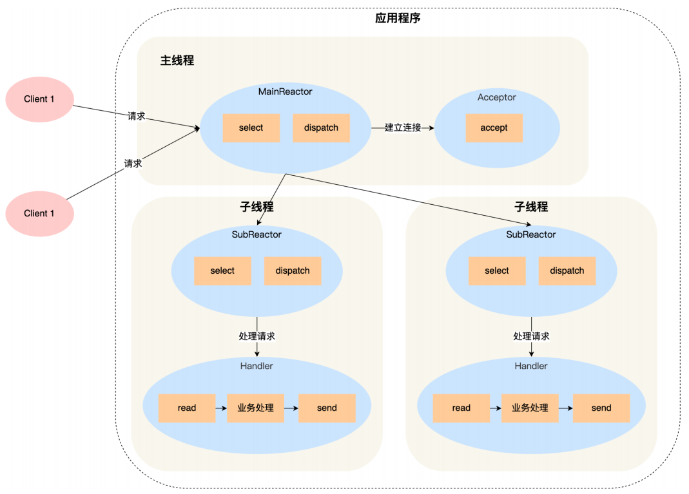

# WebServer记录

## 事件处理模式

开发平台以及部署平台都是Linux，因而选择Reactor模式。这是因为Linux下的异步I/O是不完善的，aio系列函数是在用户空间出来的，不是由操作系统支持的，故部署在Linux上的高性能服务器大多选择Reactor模式。Reactor模式有三种常用方案：

- 单Reactor单进程/线程
- 单Reactor多线程
- 多Reactor多线程

单Reactor单进程/线程方案实现起来非常简单，不涉及任何进程或线程间的通信，但缺点也是十分明显的。一旦业务逻辑处理速度过慢，将导致严重的延迟响应。因此，单Reactor单进程/线程模式适合业务处理较为快速的场景。单Reactor多线程解决了上一个方案的问题，但由于只有一个Reactor负责所有事件的监听和响应，无法有效应对瞬时高并发的情形；多Reactor多线程不存在以上两个方案的问题，且线程间的通信也很简单，MainReactor只需将连接socket传递给SubReactor即可。数据的收发以及业务逻辑均在SubReactor中完成，任务划分十分明确。因此，本项目选择采用多Reactor多线程方案。

## MainReactor类

创建监听socket——listenfd并向Channel对象注册该文件描述符以及相应的回调函数。随后将Channel提交给EventLoop对象中的Epoll对象进行监听。Epoll对象中包含了所有需要监听的Channel

## 问题

backlog和最大并发连接数量到底该是什么关系？

Epoll的timeout到底该设置为多少？

如何处理epoll_wait超时？

epoll_wait的maxevents该如何确定？

epoll_wait如何停止？

程序退出的流程该如何设计？

有没有可能客户端发送的http请求报文由于网络受限从而分多次到达，进而可能导致一次ReadData函数调用无法获取完整的请求报文，从而让服务器误以为请求报文的语法不正确而关闭连接？

同时，write函数和send函数可能因为客户端或者服务端的缓冲已满，而不能继续写数据，从而可能导致一次WriteData函数不能把响应报文写完，这种情况又该如何处理？

当服务端从socket读取数据或写入数据出错时，应该关闭连接还是不关闭连接？

请求报文和响应报文中的http版本号需要一致吗

为什么epoll修改注册的事件时，采取取反的方式会导致invalid argument

